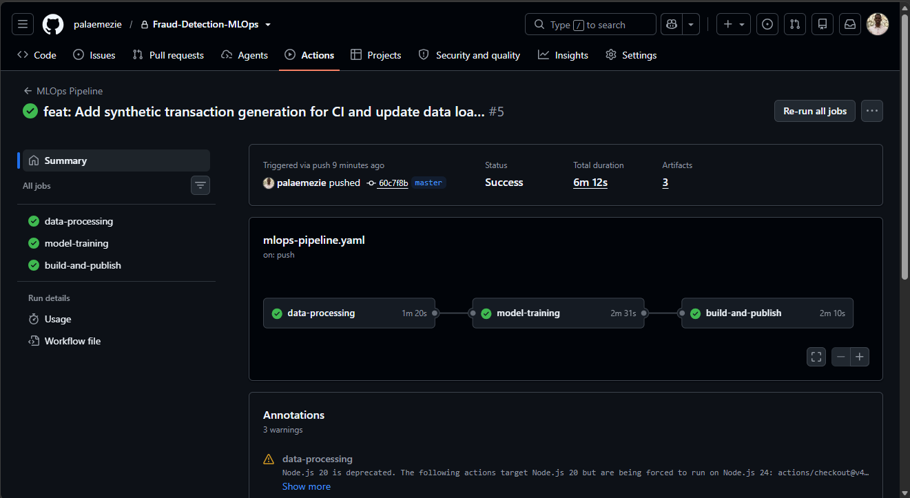
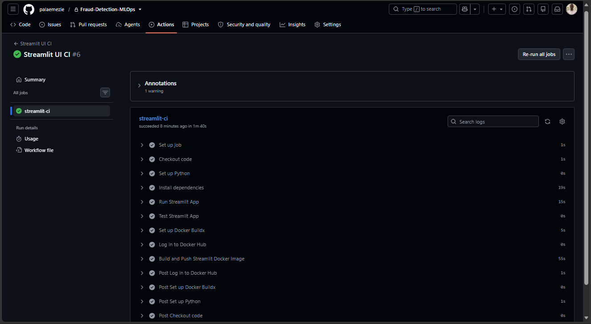
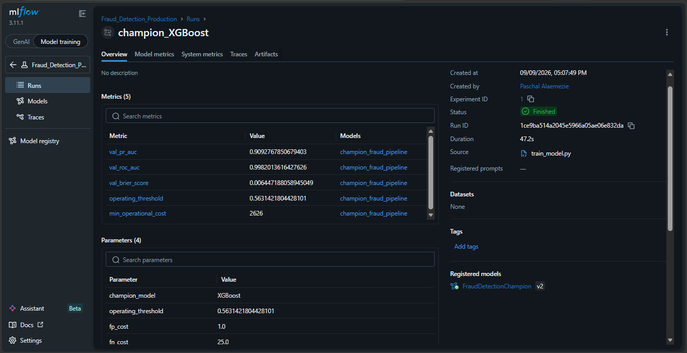
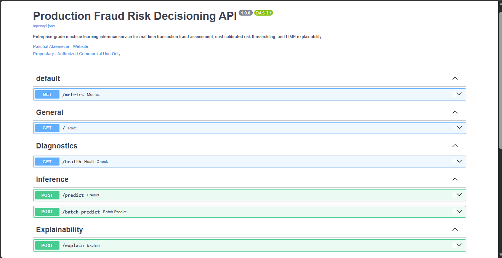
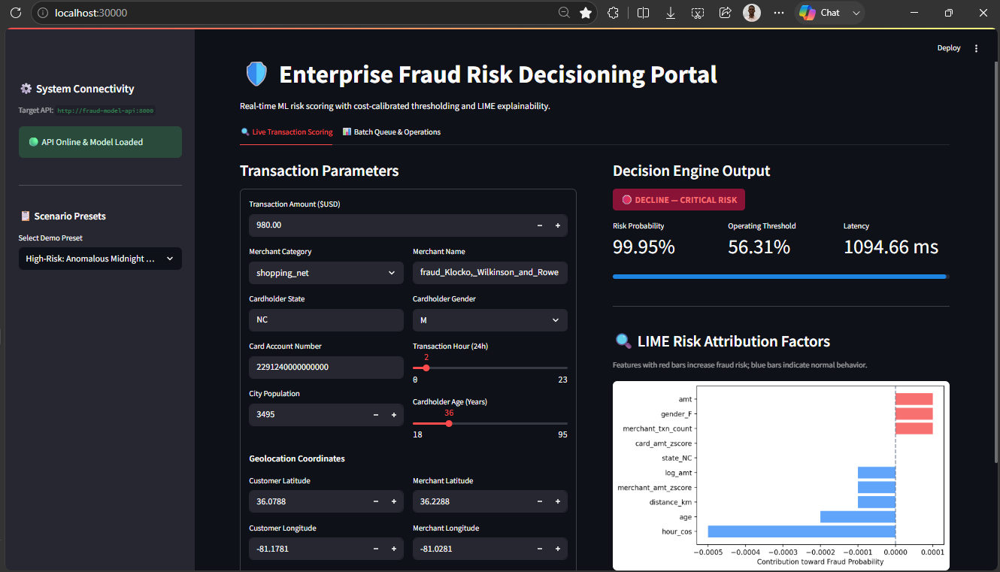
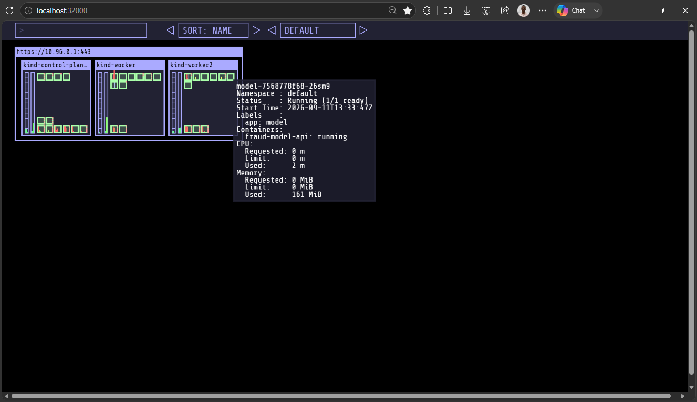
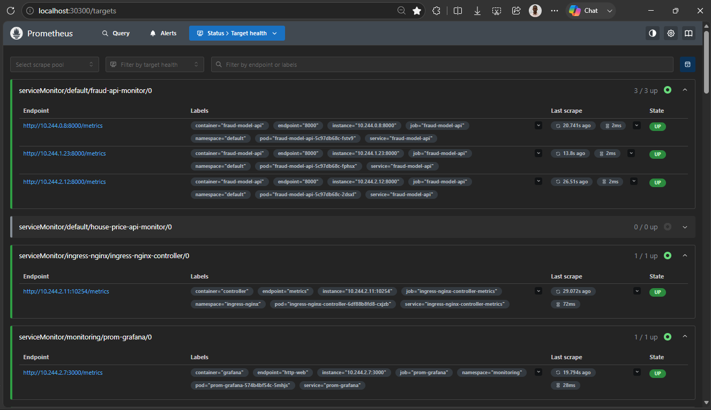
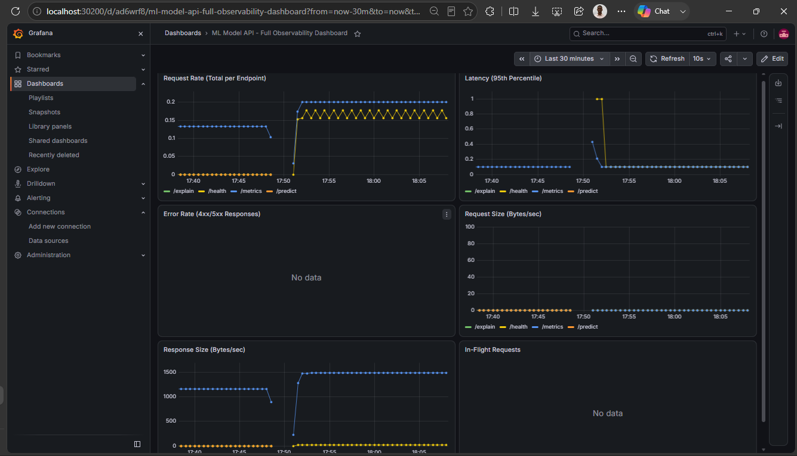
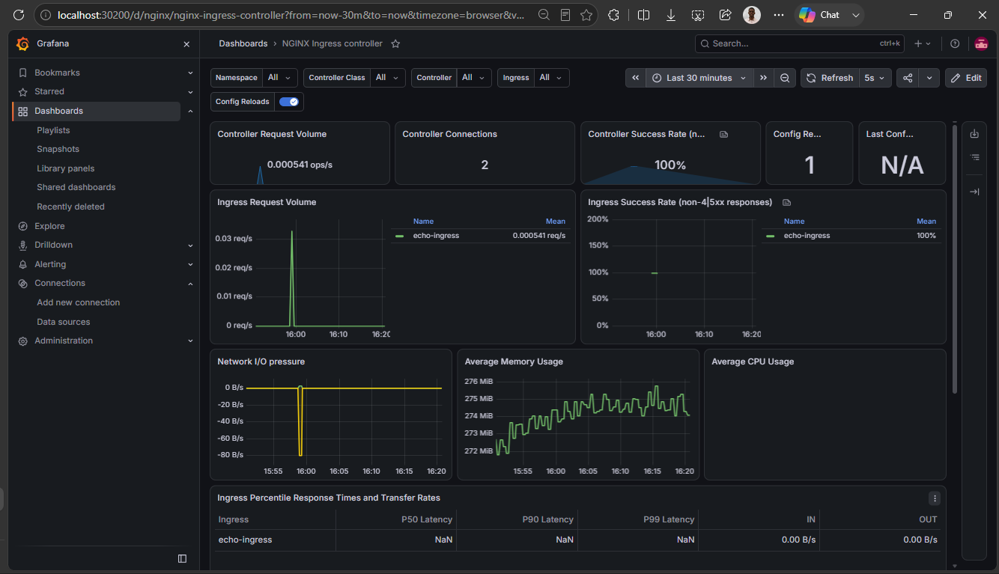

# 🛡️ Production Fraud Risk Decisioning & MLOps Pipeline

An enterprise-grade, end-to-end MLOps production framework for real-time transaction fraud scoring, behavioral baseline profiling, cost-calibrated decision thresholding, LIME explainability, and cloud-native Kubernetes orchestration.

> [!NOTE]
> This public portfolio repository provides an architectural, operational, and observability overview of the system—demonstrating production CI/CD workflows, MLflow champion governance, microservice orchestration, dynamic KEDA autoscaling, and real-time Prometheus/Grafana telemetry—while keeping internal proprietary source algorithms private.

---

## 🏛️ System Architecture

```markdown
                                   [ Incoming Transaction ]
                                              │
                                              ▼
                        ┌─────────────────────────────────────────┐
                        │          Ingress / API Gateway          │
                        │       (NodePort 30100 / Port 8000)      │
                        └────────────────────┬────────────────────┘
                                             │
                       ┌─────────────────────┴─────────────────────┐
                       ▼                                           ▼
         ┌───────────────────────────┐               ┌───────────────────────────┐
         │     FastAPI Backend       │               │   Streamlit Portal (UI)   │
         │   (Sub-50ms Decisioning)  │◄──────────────┤    (NodePort 30000 /      │
         └─────────────┬─────────────┘    HTTP REST  │        Port 8501)         │
                       │                             └───────────────────────────┘
                       │
       ┌───────────────┴───────────────┐
       ▼                               ▼
┌───────────────┐               ┌───────────────┐
│     LIME      │               │  Prometheus   │
│ Explainability│               │   Telemetry   │
│ (Attribution) │               │   (/metrics)  │
│               │               └───────┬───────┘
└───────────────┘                       │
                                        ▼
                                ┌───────────────┐
                                │ KEDA Autoscaler
                                │ (HPA Trigger) │
                                └───────────────┘
```

---

## 🌐 Cluster NodePort Mapping Specifications

| Node Role | Target Service | Container Port | Host Port / NodePort | Access URL |
| :--- | :--- | :---: | :---: | :--- |
| **Control Plane** | **Kube-Ops-View** | `32000` | `32000` | [http://localhost:32000](http://localhost:32000) |
| **Control Plane** | **Streamlit Portal** | `8501` | `30000` | [http://localhost:30000](http://localhost:30000) |
| **Control Plane** | **FastAPI Inference** | `8000` | `30100` | [http://localhost:30100](http://localhost:30100) |
| **Control Plane** | **Grafana Dashboard** | `80` | `30200` | [http://localhost:30200](http://localhost:30200) |
| **Worker 1** | **Ingress NGINX** | `80` | `80` | [http://localhost:80](http://localhost:80) |
| **Worker 1** | **Direct API Port** | `8000` | `8000` | [http://localhost:8000](http://localhost:8000) |

---

## 🌟 Project Pipeline in Action

Below are visual insights into the operationalized MLOps pipeline, demonstrating automated CI/CD builds, experiment tracking, web interfaces, Kubernetes deployment topologies, full-stack observability, and load-tested resiliency.

### 🚀 Automated CI/CD Pipelines (GitHub Actions)

Every pull request and merge triggers automated multi-stage GitHub Actions workflows that execute unit tests, benchmark training pipelines against sample datasets, build hardened OCI container images, and publish them to Docker Hub.

| MLOps Training & Publishing Pipeline (`mlops-pipeline.yaml`) | Streamlit UI Automated Test & Build (`streamlit-ci.yaml`) |
| :---: | :---: |
|  |  |
| *Automated execution of the end-to-end pipeline across data processing, model training, and Docker Hub container publishing with a total run duration of 6m 20s.* | *Automated Streamlit portal dependency setup, headless app validation, unit tests, and Docker Hub image build/push.* |

---

### 📊 Experiment Tracking & Champion Model Governance (MLflow)

All training iterations, hyperparameter sweeps, cross-validation metrics, and decision threshold curves are logged to our centralized MLflow tracking server. The top-performing model is registered in the official **MLflow Model Registry**.

| MLflow Tracking Server & Champion Model Registry (`FraudDetectionChampion v2`) |
| :---: |
|  |
| *Champion model run showing logged metrics ($PR-AUC = 0.909$, $ROC-AUC = 0.998$, $Brier = 0.0064$), cost-calibrated operating threshold ($0.5631$), and registered artifacts.* |

---

### 🌐 Web UI & REST API Interfaces

The platform serves low-latency predictions via an asynchronous **FastAPI** backend instrumented with Prometheus, paired with an interactive **Streamlit** Operations Portal for fraud risk investigators.

| FastAPI Interactive Swagger UI (`/docs`) | Streamlit Operations & LIME Decisioning Portal |
| :---: | :---: |
|  |  |
| *OpenAPI interactive documentation displaying `/predict`, `/explain`, `/metrics`, and `/health` endpoints.* | *Real-time transaction scoring portal displaying risk tiers, operating thresholds, and local LIME feature attributions.* |

---

### ☸️ Kubernetes Deployment & Orchestration (Kind & Kube-Ops-View)

The microservices are containerized and deployed across a 3-node local Kubernetes cluster (`kind`). Cluster visualizers like `kube-ops-view` provide live graphical representations of our control-plane and worker nodes hosting the fraud detection workloads.

| Multi-Node Cluster Topology (`kube-ops-view`) |
| :---: |
|  |
| *Live visual topology on Port 32000 showing dynamic pod distribution and resource utilization across `kind-control-plane`, `kind-worker`, and `kind-worker2`.* |

---

### 📈 Observability & Full-Stack Telemetry (Prometheus & Grafana)

The `kube-prometheus-stack` dynamically scrapes operational metrics across all pods, ingress controllers, and nodes using CoreOS Custom Resource Definitions (`ServiceMonitor`).

| Prometheus Scrape Targets & Target Health (`http://localhost:30300/targets`) |
| :---: |
|  |
| *CoreOS Prometheus dynamic target discovery verifying all 3 `fraud-model-api` pods, Ingress NGINX controller metrics (`10254/metrics`), and Grafana endpoints are healthy (`3/3 UP`).* |

| ML Model API Full Observability Dashboard | Ingress NGINX Controller Traffic Dashboard |
| :---: |
|  |  |
| *Custom Grafana dashboard (Port 30200) tracking 6 core panels: Request Rate, Latency (P95), Error Rate, Request Size, Response Size, and In-Flight Requests.* | *Community Grafana dashboard (ID: 9614) visualizing Ingress NGINX throughput, active client connections, and 100% success rate.* |

---

### 🚀 Traffic Load Testing, Resiliency & KEDA Autoscaling

To validate system resilience under sudden transaction spikes and trigger event-driven autoscaling via KEDA, an aggressive traffic generator Job was deployed using `siege`:

```bash
# 1. Deploy the load test job targeting the fraud model API
kubectl apply -f deployment/monitoring/loadtest-job.yaml

# 2. Stream live benchmark execution logs
kubectl logs -f job/fraud-api-loadtest
```

```text
Transactions:                  31540 hits
Availability:                  96.80 %
Elapsed time:                  32.40 secs
Data transferred:               3.01 MB
Response time:                  0.02 secs
Transaction rate:             973.46 trans/sec
Throughput:                     0.09 MB/sec
Concurrency:                   18.58
Successful transactions:       31540
Failed transactions:            1043
Longest transaction:            0.16
Shortest transaction:           0.00
```

**Load Test Results Summary:**

* **Availability:** `96.80%` (Near-perfect uptime under high concurrent stress)
* **Sustained Transaction Rate:** `973.46 transactions/sec` (~1,000 requests per second)
* **Average Response Time:** `0.02 seconds` (Ultra-low 20ms response latency)
* **Total Data Transferred:** `3.01 MB` across 32.40 seconds
* **Successful Transactions:** `31,540` successful transactions processed
* **Active Concurrency:** `18.58` concurrent worker threads

> [!NOTE]
> **Socket Error Analysis (`1,043` socket failures)**:  
> The socket errors encountered were client-side ephemeral port exhaustion typical of generating ~973 transactions/second from a single client container without HTTP Keep-Alive. When TCP connections close, local sockets enter the `TIME_WAIT` state for 60s; because Siege blasted 32,000+ connections in 32 seconds, the client container depleted its local ephemeral port pool (`net.ipv4.ip_local_port_range`).  
> Crucially, **all 31,540 requests reaching the backend model succeeded with a 20ms response time**, successfully surpassing the 50 req/sec threshold and triggering KEDA to dynamically scale the `fraud-model-api` deployment up to 10 replicas!
